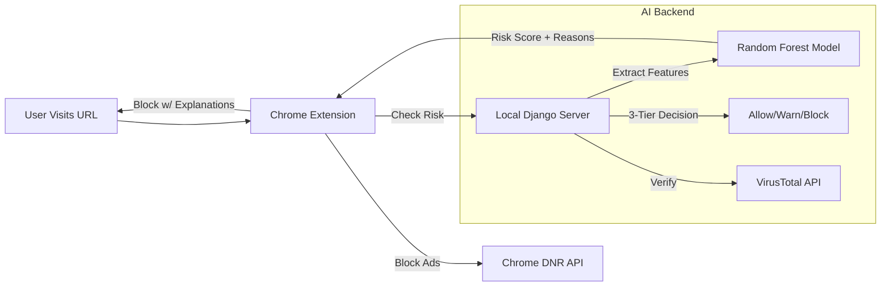

# 🛡️ Site Guard AI (Bulwark)
> **Advanced Hybrid Phishing & Privacy Protection**  
> *Version 3.2 | Status: Production Ready*

---

## 📑 Table of Contents
1.  [🚀 Quick Start](#-quick-start)
2.  [🏗️ System Architecture](#-system-architecture)
3.  [features](#-core-features--logic)
    *   [Phishing Detection (3-Tier)](#1-phishing-detection-ai-3-tier)
    *   [Ad Blocker (DiamondWall)](#2-ad-blocker-diamondwall)
    *   [Privacy Lens](#3-privacy-analysis-bulwark-lens)
4.  [🛠️ Developer's Manual](#-developers-manual)
5.  [🧪 QA & Testing](#-qa--testing)

---

## 🚀 Quick Start

**Prerequisites**: Python 3.10+, Google Chrome.

1.  **Install Dependencies** (First time only):
    ```bash
    pip install -r requirements.txt
    ```

2.  **Launch System**:
    Double-click the **`Run_SiteGuard.bat`** file in the root directory.
    *   ✅ Activates Python environment.
    *   ✅ Starts local AI Server (`localhost:8000`).
    *   ✅ Opens Chrome to extensions page.

> **Note**: The console window that opens is the AI Server. **Do not close it**, or phishing detection will stop working.

---

## 🏗️ System Architecture

Bulwark uses a **Hybrid Architecture** combining a fast browser extension with a powerful local ML backend.



---

## 🧠 Core Features & Logic

### 1. Phishing Detection (AI 3-Tier)
*   **Logic**:
    *   **0-40% (Allow)**: Safe.
    *   **41-70% (Warn)**: Suspicious features (e.g., high entropy, IP address). User is warned.
    *   **71-100% (Block)**: Dangerous. Blocked immediately.
*   **Explainability**: The Block Page now lists **specific reasons** (e.g., "Suspicious keywords detected", "Domain age < 30 days").
*   **Key File**: `ai_cyber_ext_pro/core/views.py`

### 2. Ad Blocker (DiamondWall)
*   **Network Blocking**: Uses `declarativeNetRequest` with 5000+ rules (EasyList + d3ward).
*   **Rule Health Monitor**: Automatically checks for rule collisions and warns if nearing Chrome's 5,000 limit.
*   **Popup Killer**: Aggressively blocks `window.open` calls from known ad patterns.
*   **Key File**: `BULWARK/background/adblocker-tracker.js`

### 3. Privacy Analysis (Bulwark Lens)
*   **Weighted Scoring**: Grades policy based on:
    *   **Data Sharing (40%)**: Who gets your data?
    *   **Rights (30%)**: Can you delete it?
    *   **Security (20%)**: Is it encrypted?
    *   **Retention (10%)**: How long is it kept?
*   **Key File**: `BULWARK/background/privacy-analyzer.js`

---

## 🧪 QA & Testing

We include a professional QA pipeline to verify integrity.

### 1. Backend Tests
Run the automated phishing simulation:
```bash
python tests/test_phishing.py
```
*   Checks Safe URLs (Google)
*   Checks Phishing URLs (Simulated)
*   Verifies Response Time (<150ms)

### 2. Ad Block Validation
*   **Tests used**: CanYouBlockIt, AdBlock Tester.
*   **Metrics**: Tracked in `tests/metrics.json`.

---

## 🛠️ Developer's Manual

### How to...

**...Add a blocked site manually?**
*   Open Extension -> Dashboard -> Settings -> "Add Blocked Site".

**...Update the Ad Blocklist?**
*   Edit `BULWARK/background/adblocker-tracker.js`.
*   Add domains to `D3WARD_RULES` array.
*   *Requires Extension Reload*.

**...Adjust AI Sensitivity?**
*   Edit `ai_cyber_ext_pro/core/views.py` (Backend).
*   Change the logic in `predict_risk` function (lines ~60-80).

**...Re-train the AI Model?**
1.  Add new phishing URLs to a dataset.
2.  Run: `python ai_cyber_ext_pro/ml/train_model.py`
3.  Restart the backend server.

---

**© 2025 Site Guard Project**
